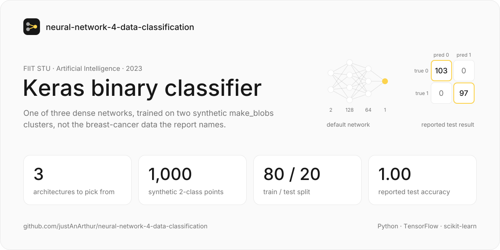
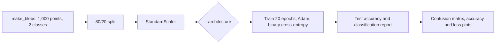
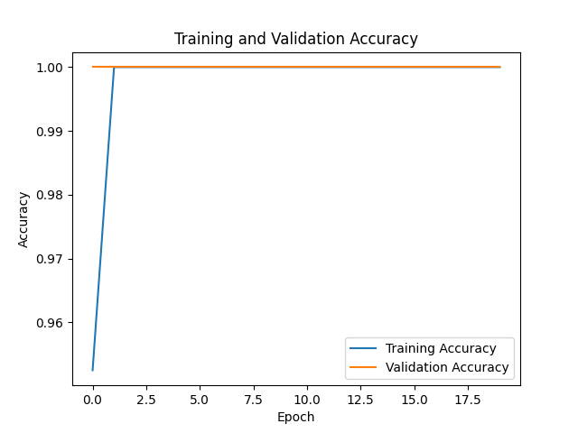
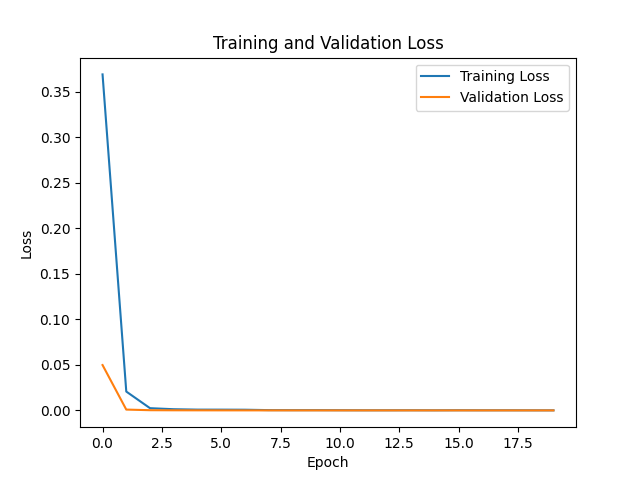
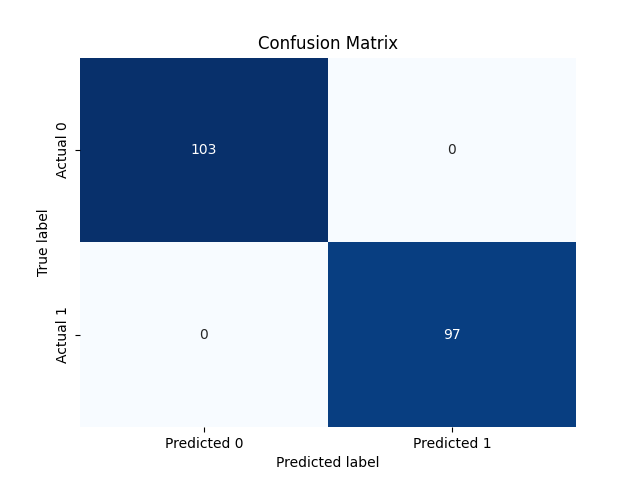
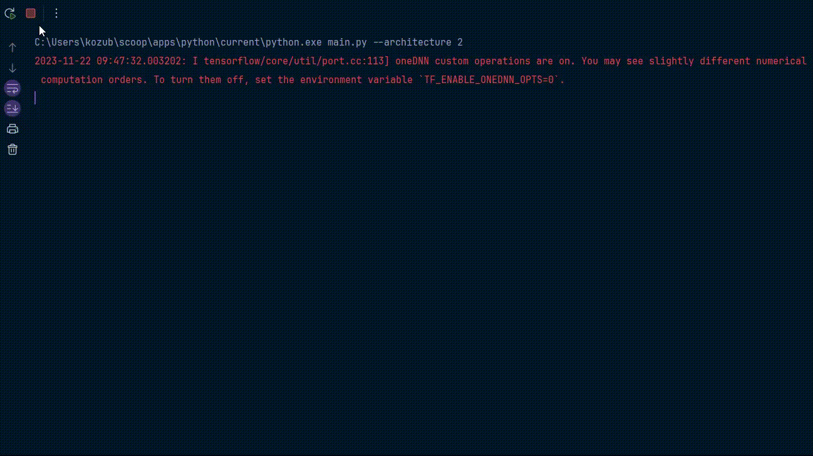

<a href="https://github.com/justAnArthur/neural-network-4-data-classification"></a>

# Keras binary classifier

Trains one of three dense Keras networks to separate two classes, then prints a classification report and plots the confusion matrix, accuracy and loss. Built for Artificial Intelligence (UI) at FIIT STU in autumn 2023.

> Finished and archived. The assignment asked for a known scikit-learn dataset, and the report and the CLI help describe breast-cancer data, but the code trains on `make_blobs`: 1,000 synthetic points in two Gaussian clusters with two features. The perfect test scores in the report come from that data.

## What it does

- Generates 1,000 points with `make_blobs(centers=2, random_state=42)`, splits them 80/20 and standardizes them with `StandardScaler`
- Builds the network picked with `--architecture` (default `1`); every one ends in a single sigmoid unit:

  | # | Hidden layers   | Activation | Dropout       |
  |---|-----------------|------------|---------------|
  | 1 | 128 → 64        | ReLU       | 0.3, 0.3      |
  | 2 | 256 → 128 → 64  | linear     | 0.4 each      |
  | 3 | 64 → 128 → 256  | ReLU       | 0.2, 0.3, 0.3 |

- Trains with Adam and binary cross-entropy for 20 epochs, batch size 32, validating on the test split
- Prints the test accuracy and scikit-learn's classification report, then shows the confusion matrix, the accuracy curve and the loss curve

## How it works



## Results

The report shows one run (it doesn't say which architecture): all 200 test points classified correctly, precision, recall and F1 of 1.00 for both classes.

| | Predicted 0 | Predicted 1 |
|---|---:|---:|
| **Actual 0** | 103 | 0 |
| **Actual 1** | 0 | 97 |

Plots from that run: [accuracy.png](accuracy.png), [loss.png](loss.png), [confusion_matrix.png](confusion_matrix.png).

## Run

```bash
pip install tensorflow scikit-learn matplotlib seaborn
python main.py                     # architecture 1
python main.py --architecture 3
```

## Stack

Python 3.10, TensorFlow / Keras for the networks, scikit-learn for the data, split, scaling and metrics, matplotlib and seaborn for the plots.

## Documentation

- [03 neural-network-4-data-classification.pdf](03%20neural-network-4-data-classification.pdf): assignment report (Slovak)
- [03 neural-network-4-data-classification.docx](03%20neural-network-4-data-classification.docx): the report as a Word file
- [03 neural-network-4-data-classification.md](03%20neural-network-4-data-classification.md): the report in Markdown, copied below
- [running_program.mp4](running_program.mp4) / [running_program.gif](running_program.gif): screen recording of `python main.py --architecture 2`

## License

[CC BY-NC-ND 4.0](LICENSE): share it with credit, but no changes and no commercial use. Don't hand it in as your own coursework.

---

## Pôvodná dokumentácia (SK)

## Zadanie úlohy (d) Problém 3. Klasifikácia datasetov scikit-learn

Nasej úlohou bolo vytvoriť sofistikovanú neurónovú sieť, ktorá bude schopná klasifikovať dáta zo známeho datasetu
dostupného v knižnici scikit-learn.

## Implementačné prostredie

Program je vytvorenej v `Python 3.10.11` a na správne fungovanie sa využíva nasledujúci knižnici:

- `argparse`
- `tensorflow`
- `sklearn`
- `matplotlib.pyplot`
- `seaborn`

### Vyber datasetu

Vybral som `make_blobs` dataset z knižnice `sklearn` a vytvoril som 3 architektúry neurónových sietí.

Výber tohto súboru údajov vychádza z niekoľkých kľúčových dôvodov:

- Kontext úlohy:
    - Tento súbor údajov modeluje vlastnosti buniek, ktoré charakterizujú rakovinu prsníka. Rakovina prsníka je
      jedným z najčastejších typov rakoviny u žien a jej včasné odhalenie zohráva kľúčovú úlohu pri liečbe a prežívaní
      pacientov.
- Binárna klasifikácia:
    - Dataset poskytuje možnosť vykonať binárnu klasifikáciu (benígny alebo malígny nádor), čo umožňuje
      vytvoriť model na určenie povahy nádoru na základe jeho vlastností.
- Dobre definované charakteristiky:
    - Súbor údajov obsahuje dobre definované charakteristiky buniek, ako je polomer,
      textúra, obvod, plocha a ďalšie parametre, ktoré môžu byť dôležité pri určovaní typu nádoru.
- Výskumný záujem:
    - Analýza a vytváranie modelov na takomto súbore údajov umožňuje hlbšie pochopiť, ktoré bunkové
      charakteristiky môžu súvisieť s tým, či je nádor malígny alebo benígny.

## Priebeh programu

Program sa spustí, a pomocou operátora „--architecture“ je mozne nastaviť architecture neurnovej siete:

```cmd
use:
   python main.py [--architecture <1-3>](1)
```

Program bude vypisovať aktuálni hodnoty, ako:

- Aktuálnu epochu (strata, presnosť pre kazdy epoch)
- A report áž na konci

A po, ukončeniu zobrazí metriky, aj graficky:

```
Classification Report:
              precision    recall  f1-score   support

           0       1.00      1.00      1.00       103
           1       1.00      1.00      1.00        97

    accuracy                           1.00       200
   macro avg       1.00      1.00      1.00       200
weighted avg       1.00      1.00      1.00       200
```

<div style="display: grid; grid-template-columns: repeat(3, minmax(0, 1fr));">







</div>

- Presnosť testu:
    - Vypočíta sa pre každú architektúru po vyškolení a vyhodnotení na testovacej množine.
- Správa o klasifikácii:
    - Uvádza presnosť, odvolanie, skóre F1 a podporu pre obe triedy.
- Matica zmätočnosti:
    - Visualize pravdivé pozitívne, falošne pozitívne, pravdivé negatívne a falošne negatívne
      predpovede modelu.

## Architektúry

### Prvá

- Dve skryté vrstvy
    - Vrstva 1: 128 neurónov, ReLU aktivácia, 30% výpadok
    - Vrstva 2: 64 neurónov, aktivácia ReLU, 30 % výpadok
- Výstupná vrstva: 1 neurón, Sigmoid aktivácia (pre binárnu klasifikáciu)

Táto architektúra má menej vrstiev a neurónov, čo môže viesť k nedostatočnému naučeniu modelu. Má tendenciu k
jednoduchším modelom a nemusí byť schopná zvládnuť učenie zložitých vzťahov v údajoch. Môže však mať tendenciu
stabilnejšie zovšeobecňovať nové údaje, čím sa vyhne nadmernému učeniu.

```python
model = tf.keras.Sequential([
    tf.keras.layers.Dense(128, input_shape=(X_train.shape[1],), activation='relu'),
    tf.keras.layers.Dropout(0.3),
    tf.keras.layers.Dense(64, activation='relu'),
    tf.keras.layers.Dropout(0.3),
    tf.keras.layers.Dense(1, activation='sigmoid')
])
```

### Druha

- Tri skryté vrstvy
    - Vrstva 1: 256 neurónov s lineárnou aktiváciou a 40% výpadkom
    - Vrstva 2: 128 neurónov s lineárnou aktiváciou a 40 % výpadkom
    - Vrstva 3: 64 neurónov s lineárnou aktiváciou a 40 % výpadkom
- Výstupná vrstva: Zachovaný jeden neurón so sigmoid aktivačnou funkciou.

Použitie lineárnej aktivácie vo všetkých skrytých vrstvách môže obmedziť schopnosť modelu získať komplexné nelineárne
závislosti v údajoch. To môže viesť k strate schopnosti zovšeobecňovania a zhoršeniu výkonnosti modelu na nových
údajoch.

```python
model = tf.keras.Sequential([
    tf.keras.layers.Dense(256, input_shape=(X_train.shape[1],), activation='linear'),
    tf.keras.layers.Dropout(0.4),
    tf.keras.layers.Dense(128, activation='linear'),
    tf.keras.layers.Dropout(0.4),
    tf.keras.layers.Dense(64, activation='linear'),
    tf.keras.layers.Dropout(0.4),
    tf.keras.layers.Dense(1, activation='sigmoid')
])
```

### Tretia

- Tri skryté vrstvy
    - Vrstva 1: 64 neurónov, ReLU aktivácia, 20% výpadok
    - Vrstva 2: 128 neurónov, ReLU aktivácia, 30 % výpadok
    - Vrstva 3: 256 neurónov, ReLU aktivácia, 30% výpadok
- Výstupná vrstva: 1 neurón, Sigmoid aktivácia (pre binárnu klasifikáciu)

Táto architektúra predstavuje zložitejší model s rôznymi kombináciami vrstiev, aktivačných funkcií a vypadávania. Takéto
siete majú väčší potenciál naučiť sa zložitejšie závislosti v údajoch, ale môžu trpieť nadmerným učením na trénovaných
údajoch.

```python
model = tf.keras.Sequential([
    tf.keras.layers.Dense(64, input_shape=(X_train.shape[1],), activation='relu'),
    tf.keras.layers.Dropout(0.2),
    tf.keras.layers.Dense(128, activation='relu'),
    tf.keras.layers.Dropout(0.3),
    tf.keras.layers.Dense(256, activation='relu'),
    tf.keras.layers.Dropout(0.3),
    tf.keras.layers.Dense(1, activation='sigmoid')
])
```

---

Tieto architektúry sa líšia počtom skrytých vrstiev, počtom neurónov v každej vrstve, použitými aktivačnými funkciami
(ReLU, sigmoid, linear) a mierou vypadúvania použitou na regularizáciu.

## Pomer testovacích a školiacich údajov

Na rozdelenie súboru údajov na tréningovú a testovaciu množinu bol zvolený pomer `80:20`:

```python
# Split the data into training and testing sets
X_train, X_test, y_train, y_test = train_test_split(data, labels, test_size=0.2, random_state=42)
```

Tento pomer zabezpečuje významnú časť údajov na trénovanie modelu a zároveň zachováva značný samostatný súbor na
vyhodnotenie výkonnosti modelu. Pomáha predchádzať nadmernému prispôsobeniu tým, že poskytuje dostatok údajov na
zovšeobecnenie.


